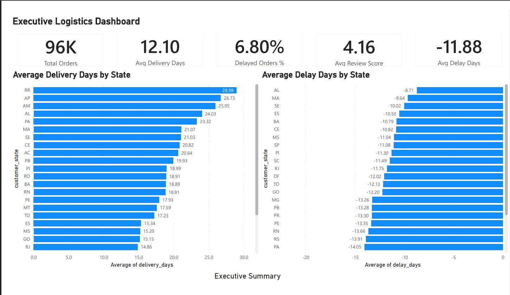
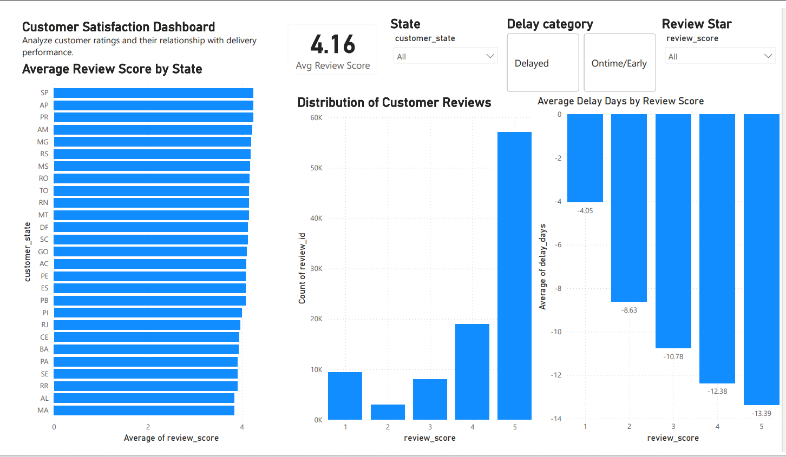
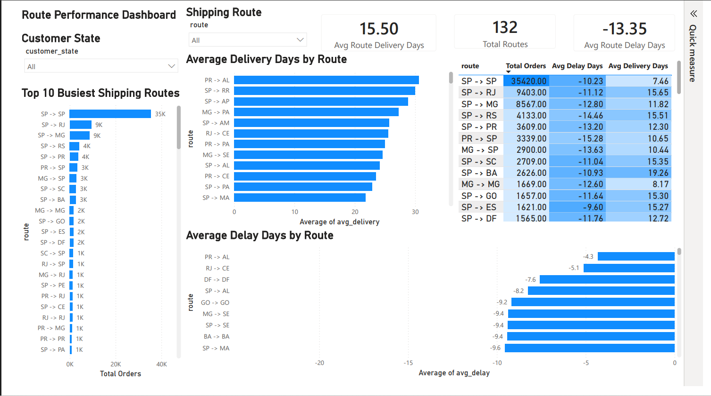

# olist-logistics-delivery-analytics
# 📦 Logistics & Delivery Performance Analytics Dashboard

An end-to-end Data Analytics project built using the Olist E-commerce dataset.

This project analyzes logistics performance, delivery efficiency, shipping routes, and customer satisfaction using Python and Power BI.

---

## 📌 Project Overview

Efficient logistics operations directly impact customer satisfaction and business performance.

This project focuses on:

- Delivery performance analysis
- Shipping delay analysis
- Route performance evaluation
- Customer review analysis
- Executive KPI reporting

The project demonstrates the complete analytics workflow from data cleaning to interactive dashboard creation.

---

# 📊 Dataset

Dataset Used:

**Olist Brazilian E-commerce Public Dataset**

The dataset contains information about:

- Orders
- Customers
- Sellers
- Reviews
- Products
- Payments
- Geolocation

After cleaning and merging the required tables, a unified analytics dataset was created for dashboard development.

---

# 🎯 Business Objectives

The project aims to answer questions such as:

- What is the average delivery time?
- Which states experience longer delivery durations?
- What percentage of orders are delayed?
- Which shipping routes handle the highest volume?
- How does delivery performance impact customer review scores?
- Which routes should be monitored for operational improvement?

---

# 🛠️ Tools & Technologies

## Programming

- Python

## Libraries

- Pandas
- NumPy

## Visualization

- Power BI

## Data Processing

- Excel
- SQL Concepts
- Feature Engineering

---

# ⚙️ Data Preparation

The raw Olist dataset was cleaned and transformed using Python.

Key preprocessing steps included:

- Handling missing values
- Filtering delivered orders
- Converting datetime columns
- Creating delivery KPIs
- Merging multiple datasets
- Creating shipping routes
- Exporting clean datasets for Power BI

---

# 📈 Feature Engineering

Additional analytical features created:

## Delivery Days

```
Delivery Date - Purchase Date
```

## Delay Days

```
Delivered Date - Estimated Delivery Date
```

Negative values indicate early delivery.

Positive values indicate delayed delivery.

## Delay Category

- Delayed
- Ontime/Early

## Shipping Route

```
Seller State -> Customer State
```

Example:

```
SP -> RJ
```

---

# 📊 Dashboard Pages

## 📄 Page 1 — Executive Dashboard

Provides a high-level overview of logistics performance.

### KPIs

- Total Orders
- Average Delivery Days
- Delayed Orders %
- Average Review Score
- Average Delay Days

### Visualizations

- Average Delivery Days by State
- Average Delay Days by State
- Top 10 Busiest Shipping Routes

---

## 📄 Page 2 — Customer Satisfaction Dashboard

Analyzes customer experience and review behavior.

### Includes

- Average Review Score by State
- Review Distribution
- Average Delay Days by Review Score

### Interactive Filters

- Customer State
- Delay Category
- Review Score

---

## 📄 Page 3 — Route Performance Dashboard

Analyzes logistics efficiency across shipping routes.

### KPIs

- Average Route Delivery Days
- Total Routes
- Average Route Delay Days

### Visualizations

- Top 10 Busiest Shipping Routes
- Average Delivery Days by Route
- Average Delay Days by Route
- Route Performance Table

---

# 📌 Key Insights

## 1. Delivery Performance

Average delivery time is approximately **12 days**.

Most orders arrive before the estimated delivery date.

---

## 2. Customer Satisfaction

Customers receiving earlier deliveries tend to leave higher ratings.

5-star reviews are associated with significantly earlier deliveries compared to 1-star reviews.

---

## 3. Route Analysis

The **SP → SP** shipping corridor handles the highest number of orders.

Different routes exhibit varying delivery performance, highlighting opportunities for logistics optimization.

---

# 📷 Dashboard Preview

## Executive Dashboard



---

## Customer Satisfaction Dashboard



---

## Route Performance Dashboard



---

# 🚀 Skills Demonstrated

- Data Cleaning
- Data Transformation
- Exploratory Data Analysis (EDA)
- Feature Engineering
- Business Intelligence
- Dashboard Design
- Power BI
- Python (Pandas)
- Logistics Analytics

---

# 📂 Project Structure

```
data/
notebooks/
powerbi/
screenshots/
README.md
```

---

# 📧 Author

**Shaurya Vishwakarma**

Aspiring Data Analyst passionate about solving business problems through data-driven insights.

LinkedIn: [*(Shaurya Vishwakarma)*](https://www.linkedin.com/in/shaurya-vishwakarma-497803318/)

